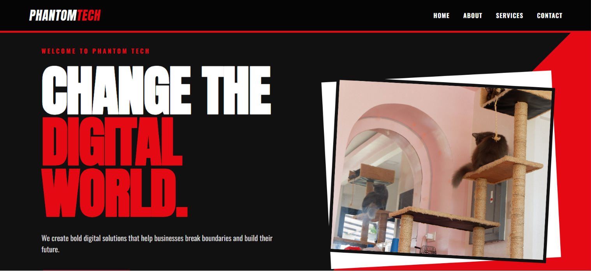
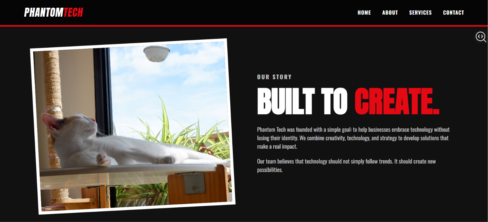
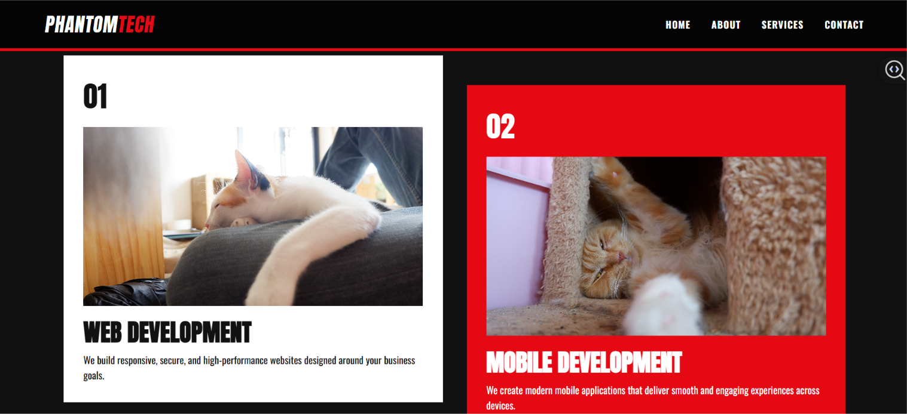
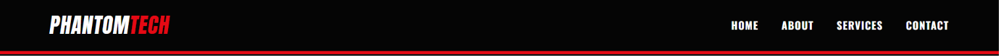
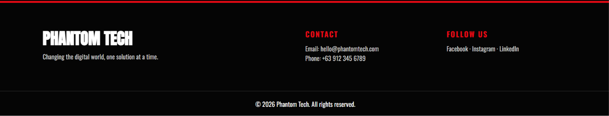
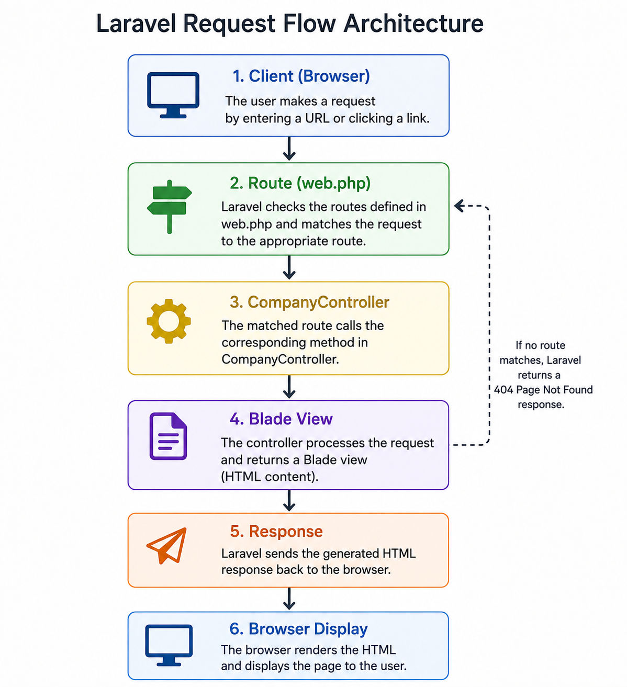

<!DOCTYPE html>
<html lang="en">
<head>
  <meta charset="UTF-8">
  <title>Phantom Tech — Company Profile Website</title>
</head>
<body>

  <h1>Phantom Tech — Company Profile Website</h1>

  <section>
    <h2>1. Project Title</h2>
    
<strong>Phantom Tech — Laravel Company Profile Website</strong>

    
A Persona-inspired company profile website developed using Laravel as part of the Week 03 Client-Server Computing activity.

  </section>

  <section>
    <h2>2. Introduction</h2>
    <h3>What is a Company Profile Website?</h3>
    
A company profile website is an online platform that introduces a business, its identity, services, values, team, and contact information to visitors. It serves as a digital representation of a company and allows potential customers and business partners to learn more about the organization.

    <h3>Why Businesses Need One</h3>
    
Businesses need a professional online presence because customers often use the internet to research companies before choosing their products or services. A company website can improve credibility, provide important information, showcase services, and make it easier for customers to contact the business.

    <h3>Purpose of the Project</h3>
    
The purpose of this project is to develop a professional company profile website using Laravel and demonstrate the Model-View-Controller (MVC) architecture.

    
The project demonstrates Laravel routing, controllers, reusable Blade layouts, Blade components, and responsive web design.

    
The website is designed with a bold red, black, and white visual style inspired by the dramatic visual aesthetic of Persona-style interfaces.

  </section>

  <section>
    <h2>3. Objectives</h2>
    <ul>
      <li>Develop a company profile website using Laravel.</li>
      <li>Implement the Model-View-Controller (MVC) architecture.</li>
      <li>Create Laravel routes for the required website pages.</li>
      <li>Create and use a <code>CompanyController</code>.</li>
      <li>Implement reusable Blade layouts.</li>
      <li>Create reusable navigation and footer components.</li>
      <li>Develop Home, About, Services, and Contact pages.</li>
      <li>Display at least six company services.</li>
      <li>Create a responsive website design.</li>
      <li>Implement a professional and visually distinctive user interface.</li>
      <li>Organize the project according to Laravel conventions.</li>
      <li>Use Git and GitHub for version control and project submission.</li>
    </ul>
  </section>

  <section>
    <h2>4. MVC Architecture</h2>
    <h3>What is MVC?</h3>
    
MVC stands for <strong>Model-View-Controller</strong>. It is a software architecture pattern that separates an application into three major parts: the Model, View, and Controller.

    <ul>
      <li><strong>Model</strong> — Handles data and business-related operations.</li>
      <li><strong>View</strong> — Handles what the user sees. In Laravel, Blade templates are commonly used to create views.</li>
      <li><strong>Controller</strong> — Handles application logic and connects user requests to the appropriate response or view.</li>
    </ul>

    <h3>Why Laravel Uses MVC</h3>
    
Laravel uses MVC because separating the different responsibilities of an application makes the code easier to understand, maintain, test, and expand.

    <h3>Advantages of MVC</h3>
    <ul>
      <li>Separation of concerns</li>
      <li>Easier code maintenance</li>
      <li>Better organization</li>
      <li>Easier testing</li>
      <li>Code reusability</li>
      <li>Easier collaboration between developers</li>
      <li>Easier expansion of larger applications</li>
    </ul>

    <h3>MVC Request Flow</h3>
    <pre>
        Browser
           │
           ▼
         Route
           │
           ▼
       Controller
           │
           ▼
       Blade View
           │
           ▼
 Response to Browser
    </pre>
  </section>

  <section>
    <h2>5. Laravel Routing</h2>
    
Routing determines how an application responds to requests made to specific URLs. Laravel routes connect a URL and HTTP method to a controller action or another application response.

    <pre><code>Route::get('/about', [CompanyController::class, 'about']);</code></pre>

    
Named routes allow reusable references:

    <pre><code>Route::get('/services', [CompanyController::class, 'services'])
    ->name('services');</code></pre>

    <h3>Route Definitions</h3>
    <pre><code>
Route::get('/', [CompanyController::class, 'home'])->name('home');
Route::get('/about', [CompanyController::class, 'about'])->name('about');
Route::get('/services', [CompanyController::class, 'services'])->name('services');
Route::get('/contact', [CompanyController::class, 'contact'])->name('contact');
    </code></pre>
  </section>

  <section>
    <h2>6. Controllers</h2>
    
Controllers handle application logic between routes and views. The project uses <code>CompanyController</code> to handle the four required pages:

    <pre><code>
class CompanyController extends Controller
{
    public function home() { return view('pages.home'); }
    public function about() { return view('pages.about'); }
    public function services() { return view('pages.services'); }
    public function contact() { return view('pages.contact'); }
}
    </code></pre>

    <ul>
      <li><code>home()</code> → Displays the Home page</li>
      <li><code>about()</code> → Displays the About page</li>
      <li><code>services()</code> → Displays the Services page</li>
      <li><code>contact()</code> → Displays the Contact page</li>
    </ul>
  </section>

  <section>
    <h2>7. Blade Templating Engine</h2>
    
Blade allows developers to create dynamic and reusable HTML templates.

    <ul>
      <li><strong>Layouts</strong>: <code>resources/views/layouts/app.blade.php</code></li>
      <li><strong>Components</strong>: <code>resources/views/components/navbar.blade.php</code>, <code>resources/views/components/footer.blade.php</code></li>
      <li><strong>Directives</strong>: <code>@extends</code>, <code>@section</code>, <code>@yield</code>, <code>@include</code></li>
    </ul>

    <pre><code>
@extends('layouts.app')

@section('title', 'Home | Phantom Tech')

@section('content')
<section class="hero">
    <h1>CHANGE THE DIGITAL WORLD.</h1>
</section>
@endsection
    </code></pre>
  </section>

  <section>
    <h2>8. Laravel Folder Structure</h2>
    <ul>
      <li><strong>app/</strong> → Controllers (<code>CompanyController</code>)</li>
      <li><strong>routes/</strong> → Route definitions (<code>web.php</code>)</li>
      <li><strong>resources/</strong> → Blade templates (<code>views/</code>)</li>
      <li><strong>public/</strong> → Assets (<code>css/style.css</code>)</li>
      <li><strong>bootstrap/</strong> → Framework bootstrapping</li>
      <li><strong>config/</strong> → Configuration files</li>
    </ul>
  </section>

  <section>
    <h2>9. Screenshots</h2>
    
The following screenshots document the completed project:

    

      <h3>Home Page</h3>
      
      <h3>About Page</h3>
      
      <h3>Services Page</h3>
      
      <h3>Contact Page</h3>
      
      <h3>Navigation Bar</h3>
      
      <h3>Footer</h3>
      
    

  </section>

        
  <section>
    <h2>10. Problems Encountered</h2>
    <h3>Problem 1 — Controller Method Error</h3>
    
During development, Laravel displayed an error indicating that the <code>home()</code> method was undefined in <code>CompanyController</code>. This occurred because the controller did not contain the required controller methods when the route attempted to call them.

    <h3>Problem 2 — View Not Found</h3>
    
Laravel displayed: <code>View [components.footer] not found.</code>

    
This happened because Laravel expected the reusable footer component at <code>resources/views/components/footer.blade.php</code>. The required file was then created in the correct directory.

    <h3>Problem 3 — CSS Was Not Applied</h3>
    
The website initially displayed without the intended styling. The stylesheet was expected at <code>public/css/style.css</code> and the Blade layout referenced it using Laravel's <code>asset()</code> helper.

    <h3>Problem 4 — Git Push Rejected</h3>
    
The first GitHub push was rejected because the remote repository already contained an initial README commit that was not present in the local repository.

    <pre><code>! [rejected] main -> main (fetch first)</code></pre>
  </section>

  <section>
    <h2>11. Solutions</h2>
    <h3>Solution 1 — Added Controller Methods</h3>
    
The required methods were added to <code>CompanyController</code>: <code>home()</code>, <code>about()</code>, <code>services()</code>, <code>contact()</code>. Each method returns its corresponding Blade view.

    <h3>Solution 2 — Created the Missing Footer Component</h3>
    
The missing file was created at <code>resources/views/components/footer.blade.php</code>. The layout could then successfully use <code>@include('components.footer')</code>.

    <h3>Solution 3 — Corrected the CSS Location</h3>
    
The stylesheet was placed in <code>public/css/style.css</code>. The layout references it with:

    <pre><code>&lt;link rel="stylesheet" href="{{ asset('css/style.css') }}"&gt;</code></pre>

    <h3>Solution 4 — Integrated the GitHub Repository</h3>
    
The local repository was connected to GitHub. Because the remote repository already contained a README, the remote history was pulled using:

    <pre><code>git pull origin main --allow-unrelated-histories</code></pre>
    
The README conflict was resolved before pushing the project to GitHub.

  </section>

  <section>
    <h2>12. Reflection</h2>
    
Developing the Phantom Tech company profile website helped me understand how Laravel's MVC architecture organizes a web application and why separation of concerns is important. Before working on this project, it was easy to think of a website as simply a collection of HTML, CSS, and PHP files. Through Laravel, I learned that different responsibilities can be separated into routes, controllers, and views, making the application more organized and easier to maintain.

    
MVC stands for Model-View-Controller. Although this project mainly focused on routing, controllers, and Blade views rather than database models, the structure demonstrated how each part has a specific responsibility. Routes receive requests and determine which controller method should handle them. The controller then processes the request and returns the appropriate view. Finally, the Blade view generates the interface that is sent back to the browser. This separation makes the application easier to understand because each part has a clear purpose.

    
I also learned the importance of reusable Blade layouts and components. Instead of copying the navigation bar and footer into every page, I created a main layout and reusable components. The pages use <code>@extends</code>, <code>@section</code>, and <code>@yield</code>, while the navigation and footer use <code>@include</code>. This reduced duplicate code and made the website easier to update. For example, changing the navigation in one component can automatically affect every page that uses it.

    
One of the most important lessons from the project was that separation of concerns becomes increasingly valuable as an application grows. A small website can seem manageable even when code is not well organized, but larger applications can contain hundreds of pages, controllers, services, and database operations. Without a clear architecture, making changes could become difficult and could introduce unexpected errors.

    
The problems encountered during development also helped me understand Laravel's error messages. Errors such as an undefined controller method, a missing Blade view, and an incorrectly loaded stylesheet initially seemed confusing, but checking the file structure and following the error messages helped me identify their causes.

    
Overall, this project improved my understanding of Laravel's MVC architecture, routing, controllers, Blade templating, reusable components, and project organization. These concepts can be applied to larger enterprise systems because they provide a structured foundation for developing applications that are easier to maintain, test, expand, and collaborate on with other developers.

  </section>

  <section>
    <h2>13. References</h2>
    <ul>
      <li><a href="https://laravel.com/docs">Laravel Documentation</a></li>
      <li><a href="https://developer.mozilla.org/">MDN Web Docs</a></li>
      <li><a href="https://www.php.net/docs.php">PHP Manual</a></li>
      <li><a href="https://laravel.com/docs/blade">Laravel Blade Templates</a></li>
      <li><a href="https://laravel.com/docs/routing">Laravel Routing</a></li>
    </ul>
  </section>

  <section>
    <h2>14. Architecture Diagram</h2>
    
The following diagram illustrates Laravel's request flow:

    
  </section>

</body>
</html>
